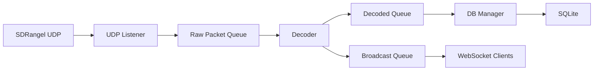
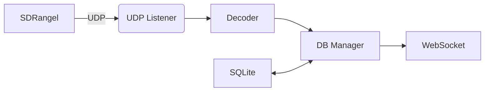
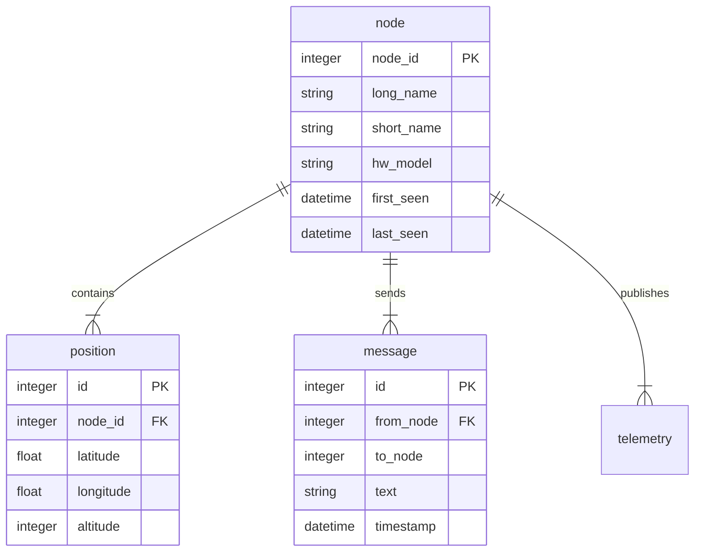

# DEVELOPER.md

> **Technical Deep Dive & Development Guide** for SDRangel Meshtastic Dashboard

This document contains the full technical specification, architecture details, and development notes for the project. It is intended for developers, contributors, and anyone who wants to understand or extend the codebase.

---

## Table of Contents

- [Project Overview](#project-overview)
- [Architecture](#architecture)
- [Core Components](#core-components)
- [Data Models & Database](#data-models--database)
- [Configuration System](#configuration-system)
- [Development Workflow](#development-workflow)
- [Testing](#testing)
- [Adding New Features](#adding-new-features)
- [AI Collaboration Guide](#ai-collaboration-guide)
- [Roadmap & Known Gaps](#roadmap--known-gaps)

---

## Project Overview

**SDRangel Meshtastic Dashboard** is a real-time web dashboard for Meshtastic packets decoded via the SDRangel Meshtastic plugin.

- **Version**: 0.1.2 (mkII - pure asyncio rewrite)
- **Core Goal**: Receive UDP packets → Decode → Store → Real-time Web UI
- **Key Design Principles**:
  - Pure asyncio (no threads)
  - Event-driven with central queues
  - Reliable background tasks with auto-restart
  - Self-contained (hosted fonts + JS)

---

## Architecture

### High-Level Flow


### Dependency Flow


### Task Management
All background tasks are wrapped with `reliable_task()` for automatic recovery.

---

## Core Components

### 1. UDP Listener (`udp_listener_task`)
- Binds to configured UDP host/port
- Receives raw packets from SDRangel
- Puts `RawPacketEvent` into `raw_packet_queue`

### 2. Decoder (`decoder_task`)
- Takes raw packets
- Parses LoRa header (first 16 bytes)
- Decrypts using AES-CTR with `MESH_KEY`
- Uses official `meshtastic` library for protobuf decoding
- Emits structured events to `decoded_packet_queue`

**Critical**: Ensure `MESH_KEY` matches your Meshtastic network key.

### 3. Database Manager (`db_manager_task`)
- Persists data to SQLite
- Handles upserts for nodes
- Broadcasts events after successful storage

### 4. Broadcaster (`broadcaster_task`)
- Pushes events to all connected WebSocket clients
- Currently only broadcasts `new_message` events

### 5. Queue System
| Queue | Capacity | Purpose |
|-------|----------|---------|
| `raw_packet_queue` | 1000 | Buffer incoming UDP spikes |
| `decoded_packet_queue` | 500 | Prevent DB overload |
| `broadcast_queue` | 200 | WebSocket stability |

---

## Data Models & Database

### Models (`models.py`)

- **Node**
- **Position**
- **TextMessage**
- **Telemetry**

### Entity Relationship Diagram


**Database Location**: `./data/app.db` (configurable)

**Key Constraints**:
- UNIQUE on `(from_node, packet_id)` for messages
- Timestamps in UTC

---

## Configuration System

Configuration is loaded from `config.toml` with `.env` overrides.

**Main parameters**:
- `UDP_HOST`, `UDP_PORT`
- `API_HOST`, `API_PORT`
- `MESH_KEY` (base64 AES key)
- Database path, logging level, etc.

See `src/meshtastic_frontend/config.py` for full details and validation.

---

## Development Workflow

### Setup
```bash
# 1. Clone the repository
git clone https://github.com/LateForTrain/sdrangel_meshtastic_dashboard_mkII.git
cd sdrangel_meshtastic_dashboard_mkII

# 2. Create virtual environment
python3 -m venv .venv
source .venv/bin/activate    # On Windows: .venv\Scripts\activate

# 3. Install dependencies
pip install -r requirements.txt

# 4. Configure config.toml
```

### Running in Development
```bash
# Main entry
python -m src.meshtastic_frontend.main

# Or using start script
python start.py
```

### Hot Reloading (optional)
Use `uvicorn` directly with reload:
```bash
uvicorn src.meshtastic_frontend.web.app:app --reload --port 8000
```

### Logging
- Logs go to console and optionally file
- Adjust level in config

---

## Testing

**Test Fixtures**: Located in `tests/test_fixtures/`

`test_msg.py` can be used to inject synthetic messages.

---

## Adding New Features

### Example: Adding Position Updates

1. Extend event types in decoder
2. Update DB model + migration logic
3. Add broadcast in DB manager
4. Update frontend (`app.js` + templates)
5. Add to WebSocket protocol docs

### Guidelines
- Keep everything async
- Use type hints
- Add to reliable_task if background
- Update this DEVELOPER.md

---

## Roadmap & Known Gaps

### Current Limitations (mkII)
- No authentication on WebSocket

### Planned
- enable config changes through web
- create log view

---

**Last Updated**: 2026-06-21

For questions, use GitHub Issues.
