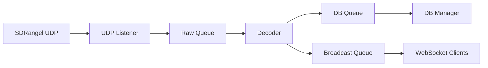

# SDRangel Meshtastic Dashboard
> **A real-time web dashboard for Meshtastic packets decoded via SDRangel**

[](https://www.python.org/downloads/)
[](LICENSE)
[]()

## Table of Contents
- [SDRangel Meshtastic Dashboard](#sdrangel-meshtastic-dashboard)
  - [Table of Contents](#table-of-contents)
  - [🚀 Quick Start](#-quick-start)
  - [✨ Features](#-features)
  - [📸 Screenshots](#-screenshots)
  - [📦 Installation](#-installation)
  - [⚙️ Configuration](#️-configuration)
  - [🧠 Architecture](#-architecture)
    - [Overview](#overview)
    - [Core Components](#core-components)
  - [🧰 Tech Stack](#-tech-stack)
  - [🌐 Web Interface](#-web-interface)
  - [🛠️ How to Run](#️-how-to-run)
  - [🧪 Testing](#-testing)
  - [🩹 Troubleshooting](#-troubleshooting)
  - [🤝 Contributing](#-contributing)
  - [🚧 Project Status \& Roadmap](#-project-status--roadmap)
  - [📜 License](#-license)

---

## 🚀 Quick Start

```bash
# 1. Clone the repository
git clone https://github.com/LateForTrain/sdrangel_meshtastic_dashboard_mkII.git
cd sdrangel_meshtastic_dashboard_mkII

# 2. Create virtual environment
python3 -m venv .venv
source .venv/bin/activate    # On Windows: .venv\Scripts\activate

# 3. Install dependencies
pip install -r requirements.txt

# 4. Configure config.toml

# 5. Start SDRangel with Meshtastic plugin sending UDP to localhost:9999

# 6. Run the dashboard
python -m src.meshtastic_frontend.main
or
python start.py
```

Open your browser and go to **http://localhost:8000**

**Verification**: Send a text message from any Meshtastic device on the same network. It should appear in the Messages view within seconds.

---

## ✨ Features

- Real-time message viewing with clean timestamps
- Interactive map showing node positions
- Telemetry dashboard (battery, environment sensors, etc.)
- Live node list with hardware details
- Persistent SQLite storage for history and analysis
- WebSocket-powered live updates
- Pure asyncio architecture (no threads)
- Self-contained frontend (fonts + Chart.js included)

**Known Limitations**:
- No authentication yet (local/trusted network only)

---

## 📸 Screenshots

Message View


Map View


---

## 📦 Installation

1. Python 3.11 or higher
2. Follow the [Quick Start](#-quick-start) above
3. Ensure SDRangel is running with the Meshtastic plugin active and UDP output enabled

Optional tools:
- `uv` for faster dependency management (`uv sync`)

---

## ⚙️ Configuration

Configuration is done via `config.toml` (with `.env` override support).

**Key settings** (`config.toml`):

```toml
UDP_HOST = "0.0.0.0"
UDP_PORT = 9999
API_HOST = "0.0.0.0"
API_PORT = 8000
MESH_KEY = "1PG7OiApB1nwvP+rz05pAQ=="   # Base64 AES key for your mesh
```

Full configuration reference is available in `src/meshtastic_frontend/config.py`.

Database is stored by default in the `data/` folder.

---

## 🧠 Architecture

### Overview
Event-driven pipeline using asyncio queues:



### Core Components
- **UDP Listener**: Receives packets from SDRangel
- **Decoder**: Uses official `meshtastic` library + AES decryption
- **DB Manager**: SQLite persistence + event generation
- **Broadcaster**: Real-time WebSocket updates

Detailed component responsibilities and queue capacities are documented in the source code.

---

## 🧰 Tech Stack

- **Backend**: Python 3.11+, FastAPI, SQLAlchemy + aiosqlite
- **Async**: Pure asyncio + queues
- **Frontend**: Jinja2 + vanilla JS + Chart.js
- **Database**: SQLite
- **Decoding**: Official `meshtastic` Python library

---

## 🌐 Web Interface

Modern split-pane dashboard with:
- Messages tab
- Map view
- Telemetry overview
- Node list
- Configuration page

All updates happen live via WebSockets. No page refreshes needed.

---

## 🛠️ How to Run

```bash
# Development
python -m src.meshtastic_frontend.main

# Or using the helper
python start.py
```

For production, use `uvicorn` directly with proper process management.

---

## 🧪 Testing

Test messages can be injected via `test_msg.py`. Active the task in the main.py.

---

## 🩹 Troubleshooting


---

## 🤝 Contributing

Contributions welcome!

1. Fork the repo
2. Create a feature branch
3. Make changes + tests
4. Open a Pull Request

---

## 🚧 Project Status & Roadmap

- **Version**: 0.1.2 (mkII - asyncio rewrite)
- **Status**: Active development
- 
---

## 📜 License

MIT License — see [LICENSE](LICENSE) file for details.

---

> *An experiment that grew into a full application. For learning and enjoyment.*
