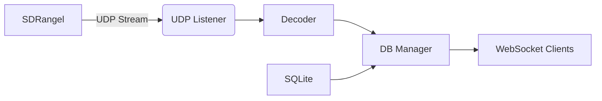

# Meshtastic SDRangel Frontend (mkII) - Living Specification

**Version:** 0.1.2  
**Last Updated:** 2026-06-04 
**Status:** Active Development  

---

## 🌐 Project Overview
> **Goal**: Receive Meshtastic packets via UDP (from SDRangel), decode them using the official meshtastic Python library, store data in SQLite, and serve a real-time web interface.  
> **Architecture**: AsyncIO-based event-driven system with central queues.  
> **Core Workflow**:
> ```mermaid
> flowchart LR
>     A[UDP Listener] -->|Raw Packets| B(Decoding)
>     B --> C[Database Manager]
>     C --> D[Broadcast Queue]
>     D --> E[WebSocket Clients]
> ```

---

## ⚙️ Key Components

### 1. Configuration System (`config.py`)
- **Purpose**: Environment-driven configuration
- **Key Parameters**:
  | Parameter | Type | Default | Description |
  |-----------|------|---------|-------------|
  | `UDP_HOST` | `str` | `"0.0.0.0"` | UDP bind address |
  | `UDP_PORT` | `int` | `9999` | UDP port for SDRangel |
  | `API_HOST` | `str` | `"0.0.0.0"` | FastAPI host |
  | `API_PORT` | `int` | `8000` | FastAPI port |
  | `MESH_KEY` | `str` | `"1PG7OiApB1nwvP+rz05pAQ=="` | AES decryption key |

### 2. Data Processing Pipeline (decoder.py + db_manager.py)
#### 📡 Input Handling
Raw Packet Structure:
- **Critical Note**: 
  ```python
  # Key used in decoder.py (decryption)
  DEFAULT_KEY = base64.b64decode(config.mesh_key)

  class RawPacketEvent:
    data: bytes          # Full UDP packet payload
    timestamp: datetime   # Received time
    source_ip: str        # Originator IP (for logging)
  ```
- **Decoding Flow:**
    1. Parse LoRa header (first 16 bytes)
    2. Decrypt with AES-CTR using mesh_key
    3. Decode protobuf payload into meaningful data

#### 💾 Database Models (models.py)
| Model | Columns | Critical Constraints |
|-----------|------|---------|
| Node | node_id(PK), long_name, short_name, hw_model, first_seen, last_seen, channel | node_id is mandatory | 
| Position| id(PK), node_id, latitude, longitude, altitude, timestamp, gps_time, precision | GPS data requires valid coordinates | 
| TextMessage| id(PK), node_id, from_node, to_node, text, timestamp, channel, packet_id | Text length capped at 200 chars (UI) | 
| Telemetry| id(PK), node_id, telemetry_type, timestamp | 16 fields of device/environment metrics | 

#### 🔐 Data Validation Rules
- Text messages:
  ```python
    # Only broadcast if text is not empty
    payload = {
    "text": message.text[:200]  # Truncate >200 chars
    }
  ```
- Database constraints:
  - UNIQUE constraint on (from_node, packet_id) for text messages
  - Timestamps stored in UTC

### 3. Background Tasks (task_manager.py)
#### Task Management Pattern
  ```python
async def reliable_task(
    coro_func: Callable[[], Awaitable[None]],
    task_name: str,
    restart_delay: float = 1.0,
    max_restarts: int = 10
    ):
    """Auto-restarts crashed tasks with backoff"""
  ```
- Failure Handling:
  - Max 10 restart attempts per task
  - Restart delay increases exponentially (2.0s → 4.0s → ...)
  - Permanent failure logs critical alert

#### Critical Tasks (main.py)
| Task | Description | Queue Source | Priority |
| :--- | :--- | :--- | :--- |
| udp_listener_task | Listens for UDP packets from SDRangel | N/A | ⭐ High |
| decoder_task | Decodes Meshtastic payloads | raw_packet_queue | ⭐⭐⭐ Critical |
| db_manager_task | Stores decoded data + broadcasts messages | decoded_packet_queue | ⭐⭐ Critical |
| broadcaster_task | Pushes events to WebSocket clients | broadcast_queue | ⭐ Low |

### 4. Web Interface (app.py)
#### API Endpoints
| Endpoint | Method | Description | Response Example |
| :--- | :--- | :--- | :--- |
| `/` | GET | Main dashboard | `{ "udp_port": 9999 }` |
| `/status` | GET | Health check | `{ "status": "online", "udp_port": 9999 }` |
| `/ws` | WS | Real-time message streaming | `{"type": "history", "messages": [...]}` |

#### WebSocket Protocol
```python
# Connection flow:
1. Client connects → adds to active_connections set
2. Immediately sends last 15 messages (via get_recent_messages)
3. Maintains heartbeat every 30s
4. Disconnects when client closes
```
#### Critical UI Requirements
- All timestamps shown in HH:MM:SS format
- Text messages truncated at 200 chars (UI side)
- Missing packet ID for text messages → show [unknown]

### 🛠️ Implementation Notes
#### 🔌 Queue System (queues.py)
- Queue Capacities:
  - raw_packet_queue: 1000 (buffering spikes)
  - decoded_packet_queue: 500 (prevents disk writes overflow)
  - broadcast_queue: 200 (critical for WebSocket stability)
- Active Connections Tracking:
```python
    active_connections: Set[WebSocket] = set() # Maintained in app state
```
### 📌 Critical Dependencies

### ⚠️ Known Gaps & TODOs
#### [IN PROGRESS] Messaging Protocol
- Current State: Only "new_message" events are broadcasted (see broadcaster.py)
- Missing Features:
  - Position updates (position_update event type)
  - Telemetry streaming
  - Node discovery events
#### [TO DO] Security
  - Critical Gap:
    ```python
        # No authentication for WebSocket connections
        # Risk: Public message broadcasting
    ```
  - Required Change:
    ```python
       Add token auth to /ws endpoint using `config.mesh_key` as HMAC secret
    ```
#### [TO DO] Database Performance
- Current limitations:
    - Text messages query limited to 20 per call (get_recent_messages(limit=20))
    - No index on to_node for message search
- Proposed Improvement:
    ```sql
        CREATE INDEX idx_to_node ON text_messages(to_node);
    ```

### 📋 Update Log (for collaborative AI)
| Date | Change Type | Specification |
| :--- | :--- | :--- |
| `[Today]` | Added security gap analysis | Specification |
| `[Previous]` | Fixed telemetry data type issue | Code fix |


---

## 🤖 AI Collaboration Instructions

### How to Ask Questions:
1. Specify the component you're modifying
2. Include relevant file references (`broadcaster.py`, `models.py`)
3. Provide desired functionality context

**Example Query**:  
*"How would I add position updates to WebSocket clients?"*  

**AI Response Template**:  
# Position Updates Implementation Plan

## Required Changes:
1. **Event Type Extension** (in `broadcaster.py`):
    ```python
    # Add to broadcast_queue event types
    AppEvent(event_type="position_update", payload={...})
    ```
2. Decoder Enhancement (decoder.py):
    ```python
    # In decode_payload() for POSITION_APP:
    if portnum == portnums_pb2.POSITION_APP:
        ...
        result['latitude'] = pos.latitude_i / 1e7  # Convert to degrees
        ...  # Preserve all position fields

    # Add to return value
    return {**result, 'position_data': True}
    ```
3. DB Manager Update (db_manager.py):
    ```python
    # In save_decoded_packet():
    elif portnum == "POSITION_APP":
        pos = decoded_to_position(decoded)
        session.add(DBPosition(**pos.__dict__))
        
        # Broadcast position update
        await broadcast_queue.put(AppEvent(
            event_type="position_update",
            payload={
                "node_id": decoded.node_id,
                "timestamp": pos.timestamp.strftime("%H:%M:%S"),
                "latitude": pos.latitude,
                "longitude": pos.longitude
            }
        ))
    ```
4. Web Client Changes (app.py):
   - Add position handler in WebSocket loop
   - Update UI component to display positions

### Critical Dependencies:
- Must have gps_time field populated in Position model (see DB schema)
- Requires broadcast_queue message type extension (position_update)

---

This specification is designed for:
1. **Human readability** (clean section headers, tables)
2. **AI parsing** (structured metadata, TODO markers)
3. **Living updates** (explicit versioning, change logs)

To update as you develop:
```diff
+ Add this block to your new file comment:
## [IN PROGRESS] New feature description [vX]
- Purpose: 1-sentence explanation
- Current implementation: Code snippet reference
- Missing pieces: Gap analysis

# TODO: Implementation steps (for AI collaboration)
