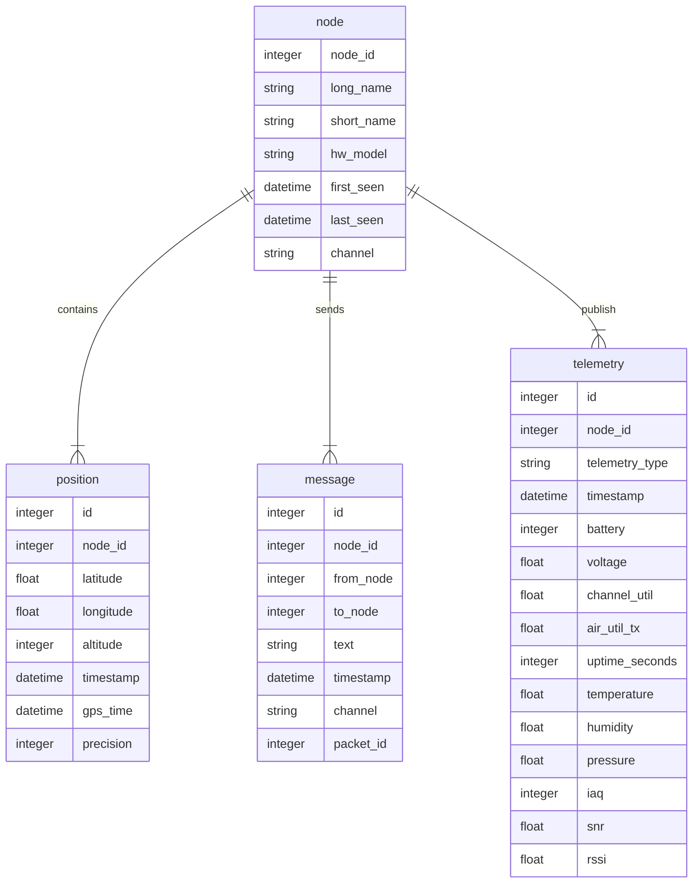
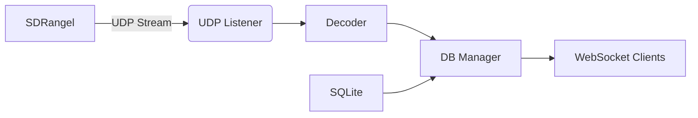

# Meshtastic SDRangel Frontend (mkII) - Living Specification

**Version:** 0.1.2  **TO BE UPDATED**
**Last Updated:** 2026-06-04 
**Status:** Active Development  

---

## 🌐 Project Overview
> **Goal**: Receive Meshtastic packets via UDP (from SDRangel), decode them using the official meshtastic Python library, store data in SQLite, and serve a real-time web interface.  
> **Architecture**: AsyncIO-based event-driven system with central queues.  
> **Core Workflow**:
> ```mermaid
> flowchart LR
>     A[UDP Listener] -->  B[Raw Packet Queue]
>     B --> C[Decoder]
>     C --> D[Database Queue]
>     D --> H[DB Manager]
>     C --> F[Broadcast Queue]
>     F --> G[WebSocket Client]
> ```

---

## ⚙️ Key Components

### 1. Configuration System (`config.py`)
- **Purpose**: Environment-driven configuration, loads configutaion from config.toml file.

- **Key Parameters in TOML file**:
  | Parameter | Type | Default | Description |
  |-----------|------|---------|-------------|
  | `UDP_HOST` | `str` | `"0.0.0.0"` | UDP bind address |
  | `UDP_PORT` | `int` | `9999` | UDP port for SDRangel |
  | `API_HOST` | `str` | `"0.0.0.0"` | FastAPI host |
  | `API_PORT` | `int` | `8000` | FastAPI port |
  | `MESH_KEY` | `str` | `"1PG7OiApB1nwvP+rz05pAQ=="` | AES decryption key |

### 2. Data Processing Pipeline (decoder.py + db_manager.py)
#### 📡 Input Handling
Raw Packet Structure:
- **Critical Note**: 
  ```python
  # Key used in decoder.py (decryption)
  DEFAULT_KEY = base64.b64decode(config.mesh_key)

  class RawPacketEvent:
    data: bytes          # Full UDP packet payload
    timestamp: datetime   # Received time
    source_ip: str        # Originator IP (for logging)
  ```
- **Decoding Flow:**
    1. Parse LoRa header (first 16 bytes)
    2. Decrypt with AES-CTR using mesh_key
    3. Decode protobuf payload into meaningful data

#### 💾 Database Models (models.py)
| Model | Columns | Critical Constraints |
|-----------|------|---------|
| Node | node_id(PK), long_name, short_name, hw_model, first_seen, last_seen, channel | node_id is mandatory | 
| Position| id(PK), node_id, latitude, longitude, altitude, timestamp, gps_time, precision | GPS data requires valid coordinates | 
| TextMessage| id(PK), node_id, from_node, to_node, text, timestamp, channel, packet_id | Text length capped at 200 chars (UI) | 
| Telemetry| id(PK), node_id, telemetry_type, timestamp | 16 fields of device/environment metrics | 

#### Database structure
The data is stored in the SQLite database, ensuring data integrity and scalability.  The data structure is optimized for efficient querying and updates, ensuring fast response times to real-time data changes.




#### 🔐 Data Validation Rules
- Text messages:
  ```python
    # Only broadcast if text is not empty
    payload = {
    "text": message.text[:200]  # Truncate >200 chars
    }
  ```
- Database constraints:
  - UNIQUE constraint on (from_node, packet_id) for text messages
  - Timestamps stored in UTC

### 3. Background Tasks (task_manager.py)
#### Task Management Pattern
  ```python
async def reliable_task(
    coro_func: Callable[[], Awaitable[None]],
    task_name: str,
    restart_delay: float = 1.0,
    max_restarts: int = 10
    ):
    """Auto-restarts crashed tasks with backoff"""
  ```
- Failure Handling:
  - Max 10 restart attempts per task
  - Restart delay increases exponentially (2.0s → 4.0s → ...)
  - Permanent failure logs critical alert

#### Critical Tasks (main.py)
| Task | Description | Queue Source | Priority |
| :--- | :--- | :--- | :--- |
| udp_listener_task | Listens for UDP packets from SDRangel | N/A | ⭐ High |
| decoder_task | Decodes Meshtastic payloads | raw_packet_queue | ⭐⭐⭐ Critical |
| db_manager_task | Stores decoded data + broadcasts messages | decoded_packet_queue | ⭐⭐ Critical |
| broadcaster_task | Pushes events to WebSocket clients | broadcast_queue | ⭐ Low |

### 4. Web Interface

#### Overview
The web interface provides a comprehensive dashboard for interacting with Meshtastic devices over a local network connection (UDP/API). It leverages FastAPI as the robust backend framework, uses Jinja2 for powerful templating, and manages real-time state updates using WebSockets.

#### Architecture Details
- **Backend Framework**: FastAPI
- **Templating Engine**: Jinja2 (`src/meshtastic_frontend/web/templates`)
- **Static Assets**: Served from the `/static` directory.
- **File Structure**: Core application logic is encapsulated in `app.py` (Application factory) and `routes.py` (Route definitions).

#### API Endpoints Reference

**HTTP Endpoints (GET)**

| Endpoint | Method | Description | Request Parameters | Response Type / Example |
|----------|--------|-------------|--------------------|-------------------------|
| `/` | GET | Main Dashboard: Renders the primary message viewing interface. | N/A | HTML (uses `index.html`) |
| `/status` | GET | Health Check & Configuration Status: Returns current operational status and local network port configurations. | None | JSON: `{ "status": "online", "udp_port": 9999, "api_port": XXXX }` |
| `/map` | GET | Renders the map view page for geospatial tracking. | N/A | HTML (uses `map.html`) |
| `/config` | GET | Renders the device configuration management page. | N/A | HTML (uses `config.html`) |

**Context Data**: All page routes pass a shared context dictionary to Jinja2, ensuring global UI consistency. This context includes: `request`, `udp_port`, `api_port`, and the `active_page` name.

#### WebSocket Protocol (Real-Time Messaging)

**Endpoint**: `/ws`

**Method**: WS

**Description**: Live Message Stream: Maintains a persistent, bidirectional connection for real-time message updates.

**Flow / Behavior Details**:
1. **Connection**: Client connects and the WebSocket object is immediately added to the global `active_connections` set.
2. **History Load**: The server sends the last 15 messages (via `get_recent_messages`).
3. **Keep-Alive**: The endpoint maintains an asynchronous wait loop (currently a fixed sleep interval).
4. **Disconnection**: Upon `WebSocketDisconnect`, the handler logs the event and removes the client from `active_connections`.

#### Critical UI Requirements & Functional Details

**Data Flow / Dependencies**
- **Connection Management**: Relies on the global set (`active_connections`) to efficiently track all connected WebSocket clients.
- **Message History**: The initial state is populated by calling `get_recent_messages` (a service layer dependency) to fetch the last 15 message records.

**Frontend Rendering Rules (Client-Side Logic)**  
The client implementation must enforce these display rules when rendering incoming messages:

1. **Timestamp Format**: All timestamps must be displayed in `HH:MM:SS` format.
2. **Message Truncation**: Text content of any message must be truncated at 200 characters (enforced client-side).
3. **Missing Metadata Handling**: If a text message arrives missing a critical packet ID, the UI display must use the placeholder `[unknown]` for that field.

#### Technical Implementation Summary

**Application Initialization (`app.py`)**
- The application utilizes a factory pattern via `create_app()` to manage initialization (e.g., dependency injection and lifecycle events).
- Templates are configured to read from the specified path: `src/meshtastic_frontend/web/templates`.
- Static assets (CSS, JS) are mounted globally under `/static` for seamless client access.

**Route Definition (`routes.py`)**
- The function `add_routes(app, templates)` is the central point for routing all web and API logic.
- **Concurrency Handling**: The routes utilize Python's `asyncio` module to manage asynchronous I/O operations required for both HTTP requests and continuous WebSocket streams.

### 🛠️ Implementation Notes
#### 🔌 Queue System (queues.py)
- Queue Capacities:
  - raw_packet_queue: 1000 (buffering spikes)
  - decoded_packet_queue: 500 (prevents disk writes overflow)
  - broadcast_queue: 200 (critical for WebSocket stability)
- Active Connections Tracking:
```python
    active_connections: Set[WebSocket] = set() # Maintained in app state
```
### 📌 Critical Dependencies

### ⚠️ Known Gaps & TODOs
#### [IN PROGRESS] Messaging Protocol
- Current State: Only "new_message" events are broadcasted (see broadcaster.py)
- Missing Features:
  - Position updates (position_update event type)
  - Telemetry streaming
  - Node discovery events
#### [TO DO] Security
  - Critical Gap:
    ```python
        # No authentication for WebSocket connections
        # Risk: Public message broadcasting
    ```
  - Required Change:
    ```python
       Add token auth to /ws endpoint using `config.mesh_key` as HMAC secret
    ```
#### [TO DO] Database Performance
- Current limitations:
    - Text messages query limited to 20 per call (get_recent_messages(limit=20))
    - No index on to_node for message search
- Proposed Improvement:
    ```sql
        CREATE INDEX idx_to_node ON text_messages(to_node);
    ```

### 📋 Update Log (for collaborative AI)
| Date | Change Type | Specification |
| :--- | :--- | :--- |
| `[Today]` | Added security gap analysis | Specification |
| `[Previous]` | Fixed telemetry data type issue | Code fix |


---

## 🤖 AI Collaboration Instructions

### How to Ask Questions:
1. Specify the component you're modifying
2. Include relevant file references (`broadcaster.py`, `models.py`)
3. Provide desired functionality context

**Example Query**:  
*"How would I add position updates to WebSocket clients?"*  

**AI Response Template**:  
# Position Updates Implementation Plan

## Required Changes:
1. **Event Type Extension** (in `broadcaster.py`):
    ```python
    # Add to broadcast_queue event types
    AppEvent(event_type="position_update", payload={...})
    ```
2. Decoder Enhancement (decoder.py):
    ```python
    # In decode_payload() for POSITION_APP:
    if portnum == portnums_pb2.POSITION_APP:
        ...
        result['latitude'] = pos.latitude_i / 1e7  # Convert to degrees
        ...  # Preserve all position fields

    # Add to return value
    return {**result, 'position_data': True}
    ```
3. DB Manager Update (db_manager.py):
    ```python
    # In save_decoded_packet():
    elif portnum == "POSITION_APP":
        pos = decoded_to_position(decoded)
        session.add(DBPosition(**pos.__dict__))
        
        # Broadcast position update
        await broadcast_queue.put(AppEvent(
            event_type="position_update",
            payload={
                "node_id": decoded.node_id,
                "timestamp": pos.timestamp.strftime("%H:%M:%S"),
                "latitude": pos.latitude,
                "longitude": pos.longitude
            }
        ))
    ```
4. Web Client Changes (app.py):
   - Add position handler in WebSocket loop
   - Update UI component to display positions

### Critical Dependencies:
- Must have gps_time field populated in Position model (see DB schema)
- Requires broadcast_queue message type extension (position_update)

---

This specification is designed for:
1. **Human readability** (clean section headers, tables)
2. **AI parsing** (structured metadata, TODO markers)
3. **Living updates** (explicit versioning, change logs)

To update as you develop:
```diff
+ Add this block to your new file comment:
## [IN PROGRESS] New feature description [vX]
- Purpose: 1-sentence explanation
- Current implementation: Code snippet reference
- Missing pieces: Gap analysis

# TODO: Implementation steps (for AI collaboration)
